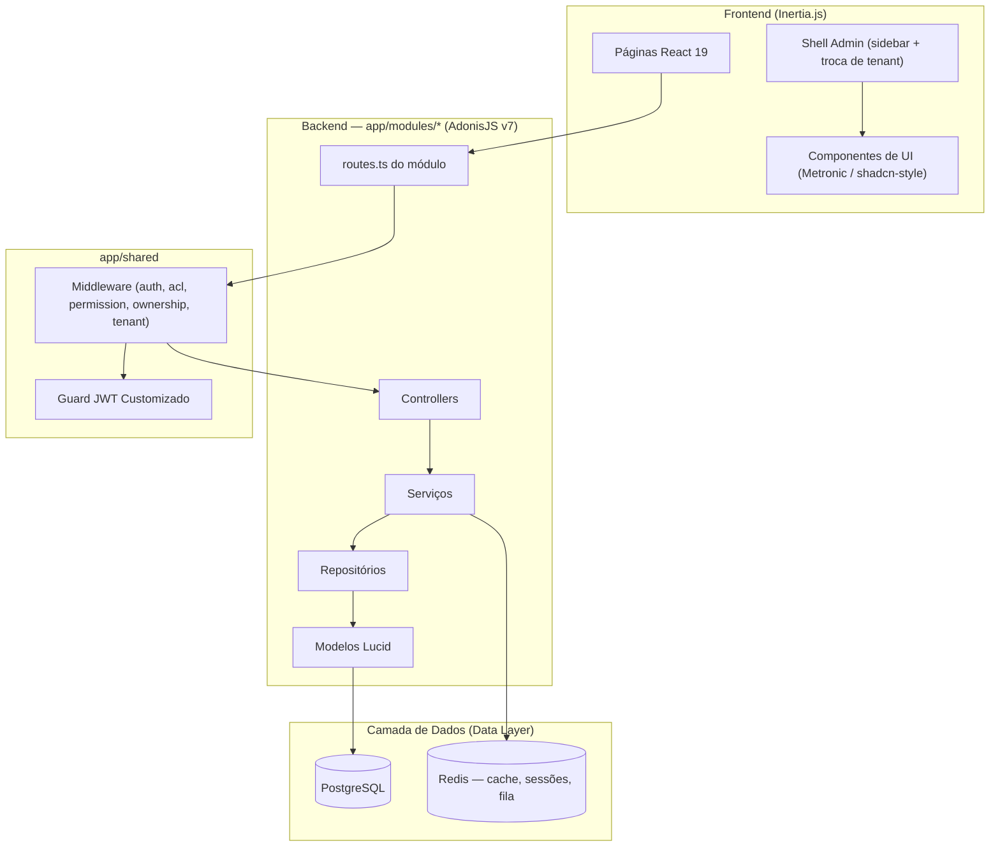

<h1 align="center">
  
</h1>

<p align="center">
  <a href="https://github.com/gabrielmaialva33/adonis-web-kit/actions/workflows/ci-cd.yml">
    
  </a>
  
  
  
  <a href="https://github.com/gabrielmaialva33/adonis-web-kit/commits/master">
    
  </a>
</p>

<p align="center">
    <a href="README.md">Inglês</a>
    ·
    <a href="README-pt.md">Português</a>
</p>

<p align="center">
  <a href="#bookmark-sobre">Sobre</a>&nbsp;&nbsp;&nbsp;|&nbsp;&nbsp;&nbsp;
  <a href="#rocket-desenvolvimento-ai-first">Desenvolvimento AI-First</a>&nbsp;&nbsp;&nbsp;|&nbsp;&nbsp;&nbsp;
  <a href="#computer-tecnologias">Tecnologias</a>&nbsp;&nbsp;&nbsp;|&nbsp;&nbsp;&nbsp;
  <a href="#package-instalação">Instalação</a>&nbsp;&nbsp;&nbsp;|&nbsp;&nbsp;&nbsp;
  <a href="#memo-licença">Licença</a>
</p>

## :bookmark: Sobre

O **Adonis Web Kit** é um _starter kit_ full-stack moderno, opinativo e focado em IA, projetado para acelerar o
desenvolvimento de aplicações web robustas. Ele combina um poderoso backend em **AdonisJS v7** com um frontend dinâmico
em **React 19** e **Inertia.js**, tudo dentro de uma estrutura monorepo unificada.

Este projeto não é apenas uma coleção de tecnologias; é uma fundação projetada para eficiência, escalabilidade e
colaboração transparente com parceiros de desenvolvimento de IA. O backend é organizado em **módulos de domínio** e já
vem com autenticação multi-guard, controle de acesso baseado em papéis (RBAC), **multi-tenancy N:N** e gerenciamento de
arquivos prontos para uso — permitindo que desenvolvedores (humanos e IAs) foquem na lógica de negócio em vez de código
repetitivo.

### 🏗️ Visão Geral da Arquitetura

O backend é **modular (orientado a domínio)**: cada domínio (`auth`, `users`, `roles`, `permissions`, `files`, `audits`,
`tenants`, `health`, `web`) é dono dos seus controllers, serviços, repositórios, modelos, validators e rotas em
`app/modules/<domínio>/`. Código transversal (middleware, guard JWT, repositório/modelos base) fica em `app/shared/`, e
as exceptions tipadas em `app/exceptions/`.



## :rocket: Desenvolvimento AI-First

Este _starter kit_ foi projetado de forma única para maximizar a eficácia da codificação assistida por IA.

- **Contexto Unificado (Monorepo)**: Ter o código do backend e do frontend em um único repositório fornece um contexto
  completo para ferramentas de IA, permitindo que elas gerem código mais preciso e coeso que abrange toda a stack.
- **Base Fortemente Tipada**: O uso de TypeScript de ponta a ponta cria um contrato claro entre as camadas de frontend,
  backend e API. Isso reduz a ambiguidade e permite que a IA entenda estruturas de dados e assinaturas de funções,
  resultando em menos erros.
- **Arquitetura Modular e Orientada a Domínio**: Cada domínio é autocontido em `app/modules/<domínio>/`, então uma IA
  (ou um humano) consegue localizar, entender e modificar uma feature de ponta a ponta sem caçar entre camadas soltas.
- **Foco na Lógica de Negócio**: Com o boilerplate de autenticação, permissões e armazenamento de arquivos já resolvido,
  a IA pode ser direcionada para resolver problemas de negócio de nível superior desde o primeiro dia.

## 🌟 Principais Funcionalidades

- **🔐 Autenticação Multi-Guard**: Quatro guards prontos — JWT (padrão, cookie + header), API access tokens, sessão e
  basic auth.
- **👥 Controle de Acesso Avançado (RBAC)**: Papéis, permissões, permissões diretas no usuário, herança de papéis e
  checagem de permissão com cache.
- **🏢 Multi-Tenancy (N:N)**: Usuários pertencem a vários tenants via pivot `user_tenants` (com papéis
  `owner`/`admin`/`member`). O tenant ativo viaja no JWT e é alternável por endpoints de API e web.
- **📁 Gerenciamento de Arquivos**: Serviço de upload pré-configurado com suporte para drivers local, S3, Spaces, R2 e
  GCS.
- **⚡️ Reatividade Full-Stack**: O poder do React combinado com a simplicidade de uma aplicação tradicional renderizada
  no servidor, graças ao Inertia.js.
- **🎨 Biblioteca de Componentes de UI**: ~78 componentes Metronic (estilo shadcn) sobre Radix UI, Tailwind CSS v4 e
  `lucide-react`, além de um shell admin com sidebar, troca de tenant e alternância de tema.
- **✅ Stack Type-Safe**: TypeScript de ponta a ponta com checagem de tipos no backend e no frontend.
- **🏥 Health Checks**: Endpoint de verificação de saúde integrado para monitoramento.

## :computer: Tecnologias

### Núcleo

- **[AdonisJS v7](https://adonisjs.com/)**: Um framework Node.js robusto para o backend (roda TypeScript direto via `@poppinss/ts-exec`).
- **[Node.js 24 LTS](https://nodejs.org/)**: O runtime (`.nvmrc` → `v24.13.0`).
- **[React 19](https://react.dev/)**: Uma poderosa biblioteca para construir interfaces de usuário.
- **[Inertia.js v3](https://inertiajs.com/)**: A cola que conecta o frontend moderno com o backend.
- **[TypeScript](https://www.typescriptlang.org/)**: Para segurança de tipos em toda a stack.
- **[PostgreSQL](https://www.postgresql.org/)**: Um banco de dados relacional confiável e poderoso (SQLite disponível para testes).
- **[Redis](https://redis.io/)**: Usado para cache, sessões e a fila Bull.
- **[Vite](https://vitejs.dev/)**: Para uma experiência de desenvolvimento frontend ultrarrápida.
- **[Tailwind CSS v4](https://tailwindcss.com/)**: Framework CSS utility-first que sustenta a biblioteca de componentes Metronic.

### Bibliotecas de frontend

- **[TanStack Table v9](https://tanstack.com/table)**: Data grids headless (os componentes `DataGrid` em `inertia/components/ui/`).
- **[TanStack Query](https://tanstack.com/query)**: Cache de estado de servidor para requisições no cliente.
- **[React Hook Form](https://react-hook-form.com/)** + **[Zod](https://zod.dev/)**: Estado de formulários e validação por schema.
- **[Radix UI](https://www.radix-ui.com/)** + **[lucide-react](https://lucide.dev/)**: Primitivos e ícones por trás da biblioteca de componentes.
- **[Recharts](https://recharts.org/)**, **[dnd-kit](https://dndkit.com/)**, **[Motion](https://motion.dev/)**: Gráficos, drag-and-drop e animação.

### Bibliotecas de backend

- **[Lucid ORM](https://lucid.adonisjs.com/)**: Models, migrations e query builder com estratégia de nomes em snake_case.
- **[VineJS](https://vinejs.dev/)**: Validação de requisições na borda do sistema.
- **[Bull Queue](https://github.com/RomainLanz/adonis-bull-queue)**: Jobs em background sobre o Redis.

### Testes

- **[Japa](https://japa.dev/)**: Suítes de backend unit, functional e browser (browser via Playwright).
- **[Vitest](https://vitest.dev/)** + **[Testing Library](https://testing-library.com/)** + **[MSW](https://mswjs.io/)**: Testes do frontend.

> **Nota sobre o TypeScript.** A dependência `typescript` está apontada para
> `@typescript/typescript6`, enquanto o TS 7 entra como `typescript-native`. O `typescript-eslint`
> ainda não suporta a API do TS 7 ([#10940](https://github.com/typescript-eslint/typescript-eslint/issues/10940))
> e resolve o TypeScript via peer dependency, então os dois rodam lado a lado: o ESLint usa a API do
> TS 6 e o `pnpm typecheck`/`pnpm build` usam o `tsc` do TS 7. Volte a ter uma única entrada
> `typescript` assim que o typescript-eslint acompanhar.

## :package: Instalação

### ✔️ Pré-requisitos

- **Node.js 24 LTS** (`.nvmrc` → `v24.13.0`)
- **pnpm**
- **PostgreSQL** e **Redis** (ambos obrigatórios para dev e testes — mais fácil via Docker)

### 🚀 Começando

1. **Clone o repositório:**

   ```sh
   git clone https://github.com/gabrielmaialva33/adonis-web-kit.git
   cd adonis-web-kit
   ```

2. **Instale as dependências:**

   ```sh
   pnpm install
   ```

3. **Configure as variáveis de ambiente:**

   ```sh
   cp .env.example .env
   ```

   _Abra o arquivo `.env` e configure suas credenciais de banco de dados e outras configurações._

4. **Execute as migrações do banco de dados (e o seed):**

   ```sh
   pnpm ace migration:run
   pnpm ace db:seed
   ```

5. **Inicie o servidor de desenvolvimento:**
   ```sh
   pnpm dev
   ```
   _Sua aplicação estará disponível em `http://localhost:3333`._

### 📜 Scripts Disponíveis

- `pnpm dev`: Inicia o servidor de desenvolvimento com HMR.
- `pnpm build`: Compila a aplicação para produção.
- `pnpm start`: Executa o servidor pronto para produção.
- `pnpm ace <cmd>`: Roda qualquer comando ace do AdonisJS (ex.: `pnpm ace migration:run`).
- `pnpm test`: Executa os testes unitários do backend (Japa).
- `pnpm test:e2e`: Executa todas as suítes do backend (unit + functional + browser).
- `pnpm test:ui`: Executa os testes do frontend (Vitest).
- `pnpm typecheck`: Verifica os tipos no backend e no frontend.
- `pnpm lint`: Verifica o código com o linter.
- `pnpm format`: Formata o código com o Prettier.

## :memo: Licença

Este projeto está licenciado sob a **Licença MIT**. Veja o arquivo [LICENSE](LICENSE) para mais detalhes.

---

<p align="center">
  Feito com ❤️ pela comunidade.
</p>
