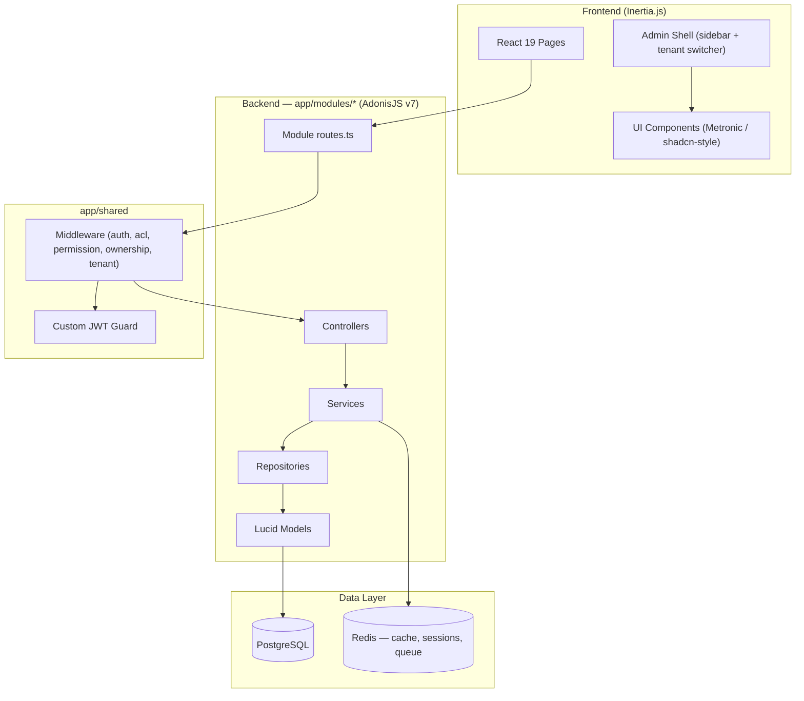

<h1 align="center">
  
</h1>

<p align="center">
  <a href="https://github.com/gabrielmaialva33/adonis-web-kit/actions/workflows/ci-cd.yml">
    
  </a>
  
  
  
  <a href="https://github.com/gabrielmaialva33/adonis-web-kit/commits/master">
    
  </a>
</p>

<p align="center">
    <a href="README.md">English</a>
    ·
    <a href="README-pt.md">Portuguese</a>
</p>

<p align="center">
  <a href="#bookmark-about">About</a>&nbsp;&nbsp;&nbsp;|&nbsp;&nbsp;&nbsp;
  <a href="#rocket-ai-first-development">AI-First Development</a>&nbsp;&nbsp;&nbsp;|&nbsp;&nbsp;&nbsp;
  <a href="#computer-technologies">Technologies</a>&nbsp;&nbsp;&nbsp;|&nbsp;&nbsp;&nbsp;
  <a href="#package-installation">Installation</a>&nbsp;&nbsp;&nbsp;|&nbsp;&nbsp;&nbsp;
  <a href="#memo-license">License</a>
</p>

## :bookmark: About

**Adonis Web Kit** is a modern, opinionated, and AI-first full-stack starter kit designed to accelerate the development of
robust web applications. It combines a powerful **AdonisJS v7** backend with a dynamic **React 19** and **Inertia.js**
frontend, all within a unified monorepo structure.

This project is not just a collection of technologies; it's a foundation engineered for efficiency, scalability, and
seamless collaboration with AI development partners. The backend is organized into **domain modules** and ships with
multi-guard authentication, role-based access control (RBAC), **N:N multi-tenancy**, and file management out of the box —
letting developers (both human and AI) focus on unique business logic instead of boilerplate.

### 🏗️ Architecture Overview

The backend is **modular (domain-driven)**: each domain (`auth`, `users`, `roles`, `permissions`, `files`, `audits`,
`tenants`, `health`, `web`) owns its controllers, services, repositories, models, validators, and routes under
`app/modules/<domain>/`. Cross-cutting code (middleware, JWT guard, base repository/models) lives in `app/shared/`, and
typed exceptions in `app/exceptions/`.



## :rocket: AI-First Development

This starter kit is uniquely designed to maximize the effectiveness of AI-assisted coding.

- **Unified Context (Monorepo)**: Having backend and frontend code in a single repository provides a complete context
  for AI tools, enabling them to generate more accurate and cohesive code that spans the full stack.
- **Strongly-Typed Foundation**: End-to-end TypeScript usage creates a clear contract between the frontend, backend, and
  API layers. This reduces ambiguity and allows AI to understand data structures and function signatures, leading to
  fewer errors.
- **Modular, Domain-Driven Architecture**: Each domain is self-contained under `app/modules/<domain>/`, so an AI (or a
  human) can locate, understand, and modify a feature end to end without spelunking across unrelated layers.
- **Focus on Business Logic**: With boilerplate for authentication, permissions, and file storage already handled, AI
  can be directed to solve higher-level business problems from day one.

## 🌟 Key Features

- **🔐 Multi-Guard Authentication**: Four guards out of the box — JWT (default, cookie + header), API access tokens,
  session, and basic auth.
- **👥 Advanced Role-Based Access Control (RBAC)**: Roles, permissions, direct user permissions, role inheritance, and
  cached permission checks.
- **🏢 Multi-Tenancy (N:N)**: Users belong to many tenants via a `user_tenants` pivot (with `owner`/`admin`/`member`
  roles). The active tenant is carried in the JWT and switchable through both API and web endpoints.
- **📁 File Management**: Pre-configured file upload service with support for local, S3, Spaces, R2, and GCS drivers.
- **⚡️ Full-Stack Reactivity**: The power of React combined with the simplicity of a traditional server-rendered app,
  thanks to Inertia.js.
- **🎨 UI Component Library**: ~78 Metronic (shadcn-style) components built on Radix UI, Tailwind CSS v4, and
  `lucide-react`, plus an admin shell with sidebar, tenant switcher, and theme toggle.
- **✅ Type-Safe Stack**: End-to-end TypeScript with type checking across backend and frontend.
- **🏥 Health Checks**: Integrated health check endpoint for monitoring.

## :computer: Technologies

### Core

- **[AdonisJS v7](https://adonisjs.com/)**: A robust Node.js framework for the backend (runs TypeScript directly via `@poppinss/ts-exec`).
- **[Node.js 24 LTS](https://nodejs.org/)**: The runtime (`.nvmrc` → `v24.13.0`).
- **[React 19](https://react.dev/)**: A powerful library for building user interfaces.
- **[Inertia.js v3](https://inertiajs.com/)**: The glue that connects the modern frontend with the backend.
- **[TypeScript](https://www.typescriptlang.org/)**: For type safety across the entire stack.
- **[PostgreSQL](https://www.postgresql.org/)**: A reliable and powerful relational database (SQLite available for tests).
- **[Redis](https://redis.io/)**: Used for caching, sessions, and the Bull queue.
- **[Vite](https://vitejs.dev/)**: For a lightning-fast frontend development experience.
- **[Tailwind CSS v4](https://tailwindcss.com/)**: A utility-first CSS framework powering the Metronic component library.

### Frontend libraries

- **[TanStack Table v9](https://tanstack.com/table)**: Headless data grids (the `DataGrid` components under `inertia/components/ui/`).
- **[TanStack Query](https://tanstack.com/query)**: Server-state caching for client-side fetches.
- **[React Hook Form](https://react-hook-form.com/)** + **[Zod](https://zod.dev/)**: Form state and schema validation.
- **[Radix UI](https://www.radix-ui.com/)** + **[lucide-react](https://lucide.dev/)**: Primitives and icons behind the component library.
- **[Recharts](https://recharts.org/)**, **[dnd-kit](https://dndkit.com/)**, **[Motion](https://motion.dev/)**: Charts, drag-and-drop, and animation.

### Backend libraries

- **[Lucid ORM](https://lucid.adonisjs.com/)**: Models, migrations, and query building with a snake_case naming strategy.
- **[VineJS](https://vinejs.dev/)**: Request validation at the edge.
- **[Bull Queue](https://github.com/RomainLanz/adonis-bull-queue)**: Background jobs on top of Redis.

### Testing

- **[Japa](https://japa.dev/)**: Backend unit, functional, and browser suites (browser via Playwright).
- **[Vitest](https://vitest.dev/)** + **[Testing Library](https://testing-library.com/)** + **[MSW](https://mswjs.io/)**: Frontend tests.

> **Note on TypeScript.** The `typescript` dependency is aliased to
> `@typescript/typescript6` while TS 7 ships as `typescript-native`. `typescript-eslint` does not
> support the TS 7 API yet ([#10940](https://github.com/typescript-eslint/typescript-eslint/issues/10940))
> and resolves TypeScript through a peer dependency, so the two run side by side: ESLint gets the
> TS 6 API, while `pnpm typecheck` and `pnpm build` use the TS 7 `tsc`. Collapse them back into a
> single `typescript` entry once typescript-eslint catches up.

## :package: Installation

### ✔️ Prerequisites

- **Node.js 24 LTS** (`.nvmrc` → `v24.13.0`)
- **pnpm**
- **PostgreSQL** and **Redis** (both required for dev and tests — easiest via Docker)

### 🚀 Getting Started

1. **Clone the repository:**

   ```sh
   git clone https://github.com/gabrielmaialva33/adonis-web-kit.git
   cd adonis-web-kit
   ```

2. **Install dependencies:**

   ```sh
   pnpm install
   ```

3. **Setup environment variables:**

   ```sh
   cp .env.example .env
   ```

   _Open the `.env` file and configure your database credentials and other settings._

4. **Run database migrations (and seed):**

   ```sh
   pnpm ace migration:run
   pnpm ace db:seed
   ```

5. **Start the development server:**
   ```sh
   pnpm dev
   ```
   _Your application will be available at `http://localhost:3333`._

### 📜 Available Scripts

- `pnpm dev`: Starts the development server with HMR.
- `pnpm build`: Compiles the application for production.
- `pnpm start`: Runs the production-ready server.
- `pnpm ace <cmd>`: Runs any AdonisJS ace command (e.g. `pnpm ace migration:run`).
- `pnpm test`: Executes backend unit tests (Japa).
- `pnpm test:e2e`: Executes all backend suites (unit + functional + browser).
- `pnpm test:ui`: Executes frontend tests (Vitest).
- `pnpm typecheck`: Type-checks both backend and frontend.
- `pnpm lint`: Lints the codebase.
- `pnpm format`: Formats the code with Prettier.

## :memo: License

This project is licensed under the **MIT License**. See the [LICENSE](LICENSE) file for details.

---

<p align="center">
  Made with ❤️ by the community.
</p>
